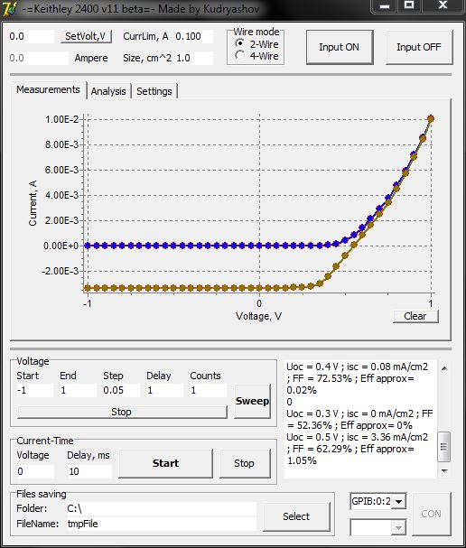

# Keithley_2400x_IV
GUI app for I-V curves measurement with Keithley 2400/2401 source meter

A small programm written with Delphi 2007.

Supported protocols: COM or GPIB (with external lib - GPIB-32.DLL)

Exe or source files are availible on request
